# UoM Blackboard theme

This project rethemes UoM's [blackboard website](https://online.manchester.ac.uk/) to look more modern and user friendly, and use a consistent colour scheme

## Install

- Install Stylus [for Firefox](https://addons.mozilla.org/en-GB/firefox/addon/styl-us/) or [for Chrome](https://chrome.google.com/webstore/detail/stylus/clngdbkpkpeebahjckkjfobafhncgmne) depending on your browser.
- Go to https://userstyles.world/style/4931/uom-blackboard-theme and click on the Install button.

### Install optional script

- Install Tampermonkey [for Firefox](https://addons.mozilla.org/en-GB/firefox/addon/tampermonkey/) or [for Chrome](https://chrome.google.com/webstore/detail/tampermonkey/dhdgffkkebhmkfjojejmpbldmpobfkfo)
- Open Tampermonkey and click "Create a new script". Then delete the starter code.
- Go to [main.js](https://github.com/adil192/BlackboardTheme/blob/main/scripts/main.js), click the copy icon, and paste into the Tampermonkey page.
- Click `File` then `Save` (or press Ctrl S).

## Notable features

- (script*) Visually distinguishes between 1st and 2nd semester courses on the Blackboard homepage.
- Rethemes several webpages such as the Blackboard homepage, Blackboard course info pages, Blackboard videos, the My Manchester portal (including the attendance page), and the UoM login page/Duo authentication page.
- Uses better, more readable fonts.
- Icons and logos replaced by similar ones that mesh better with the page.
- Styling inspired by Google's Material Design.

Features starting with "script* require you to install the optional script (see the [Install](https://github.com/adil192/BlackboardTheme#install) instructions).

## Screenshots

These screenshots are taken at 1.33x zoom.

| Page | Before | After |
| --- | --- | --- |
| Blackboard | 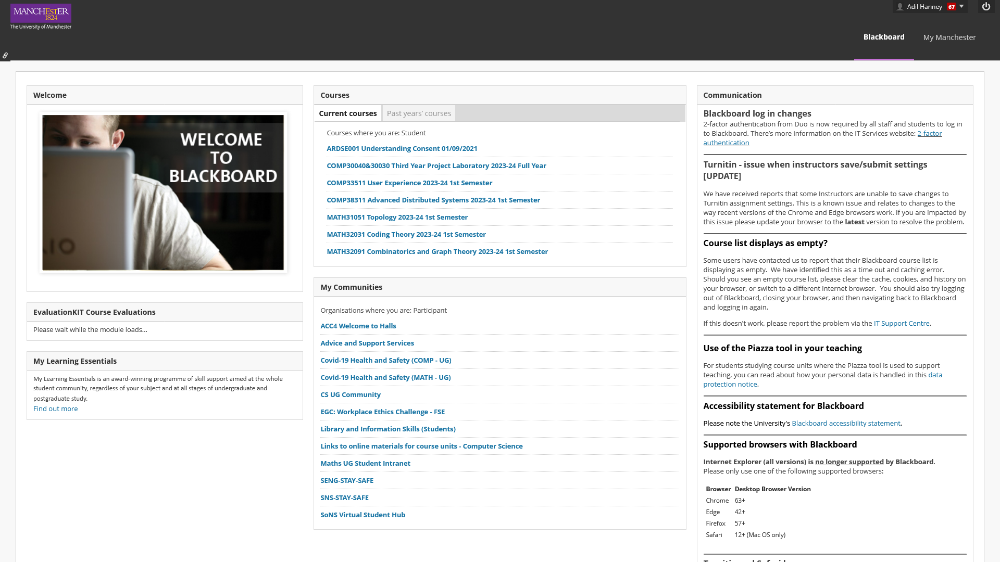 | 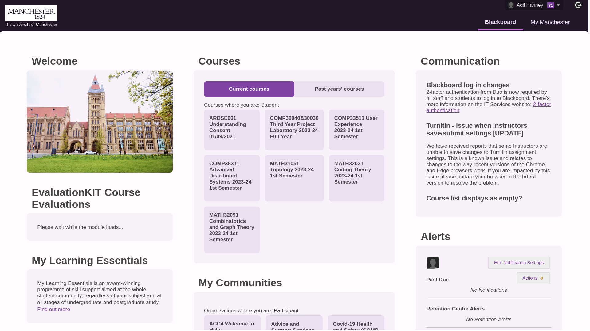 |
| Course page | 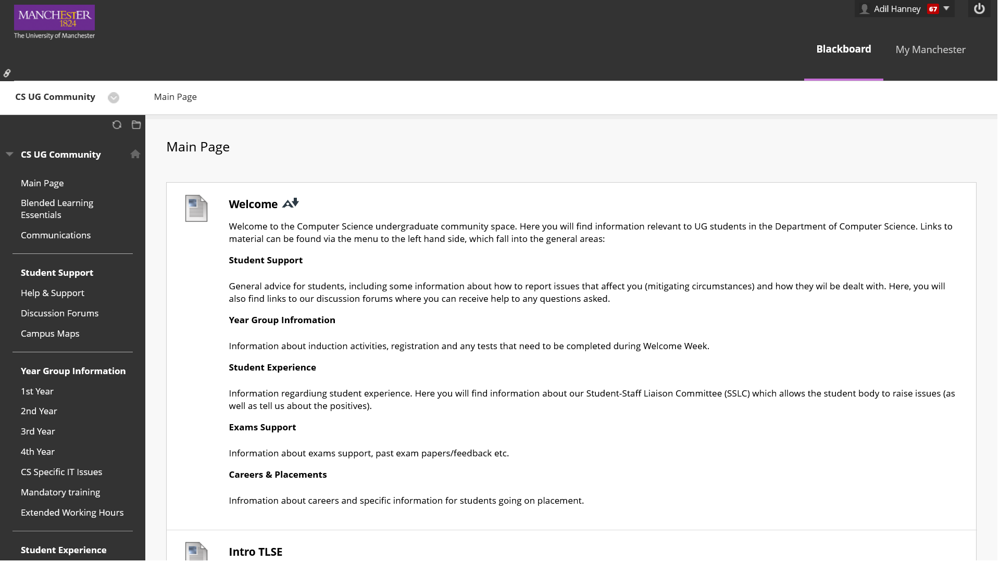 | 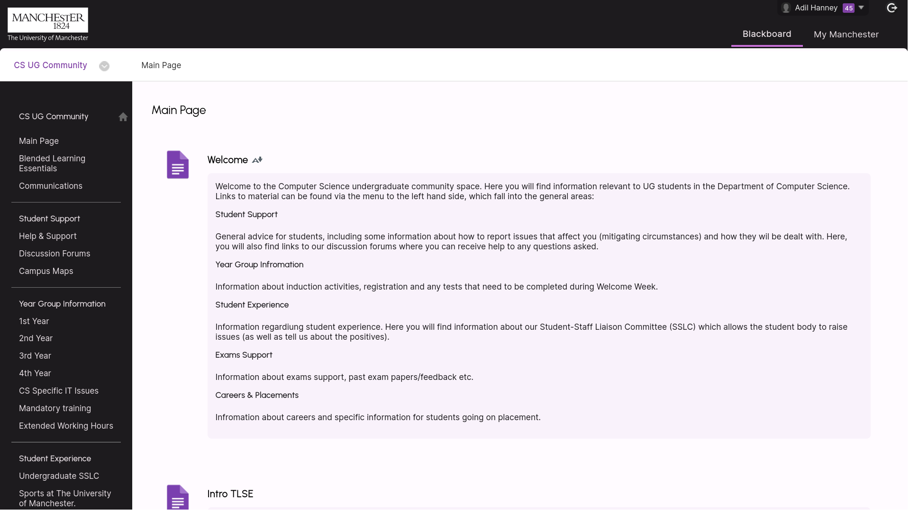 |
| Attendance | - | 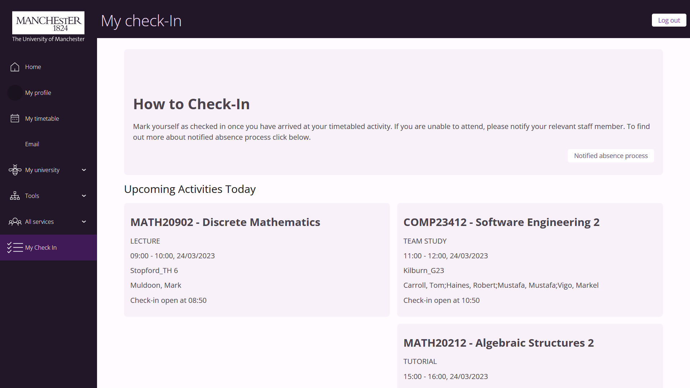 |
| Login | 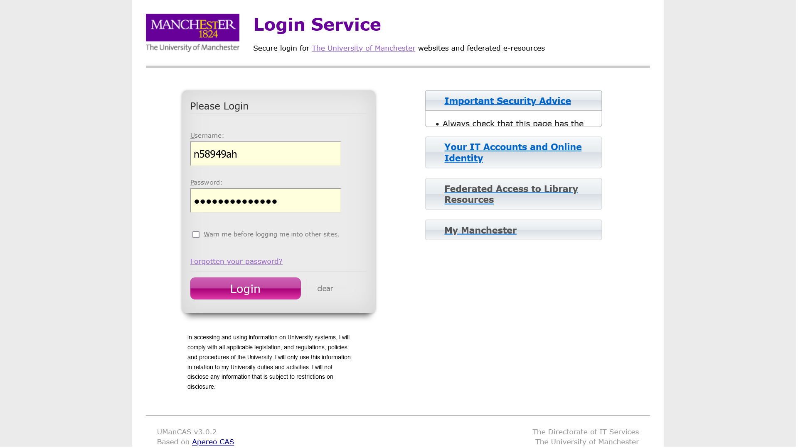 | 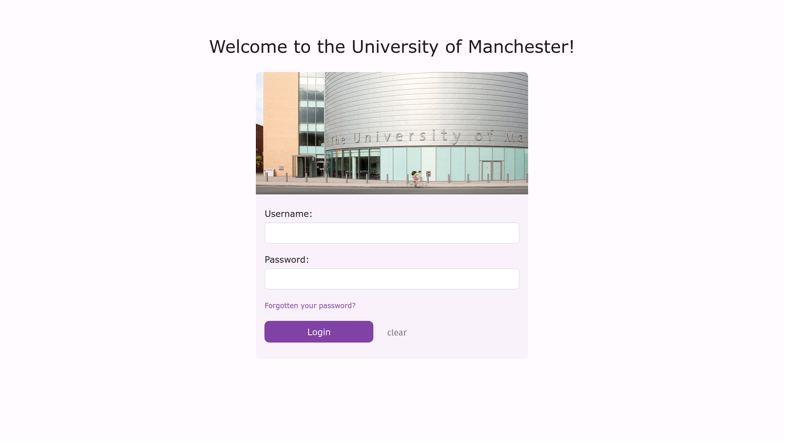 |
| Duo 2FA |  | 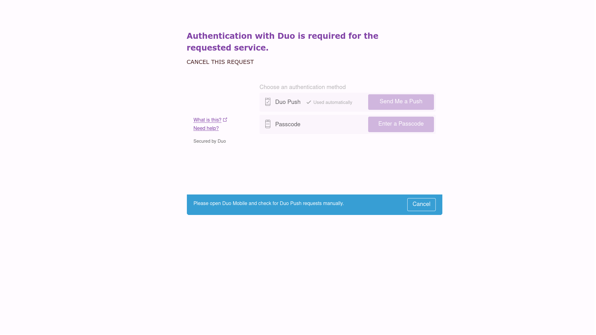 |
| Video player | 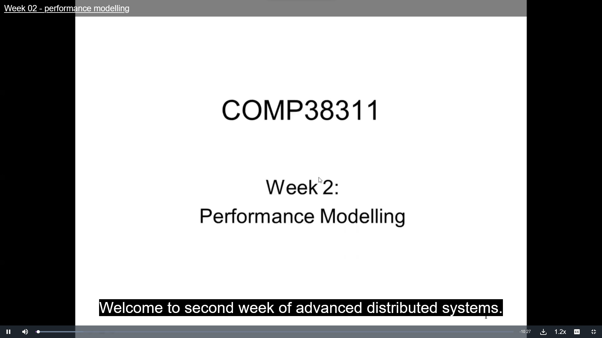 | 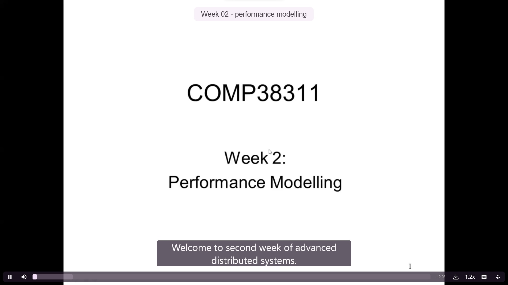 |
| IT Account Manager | 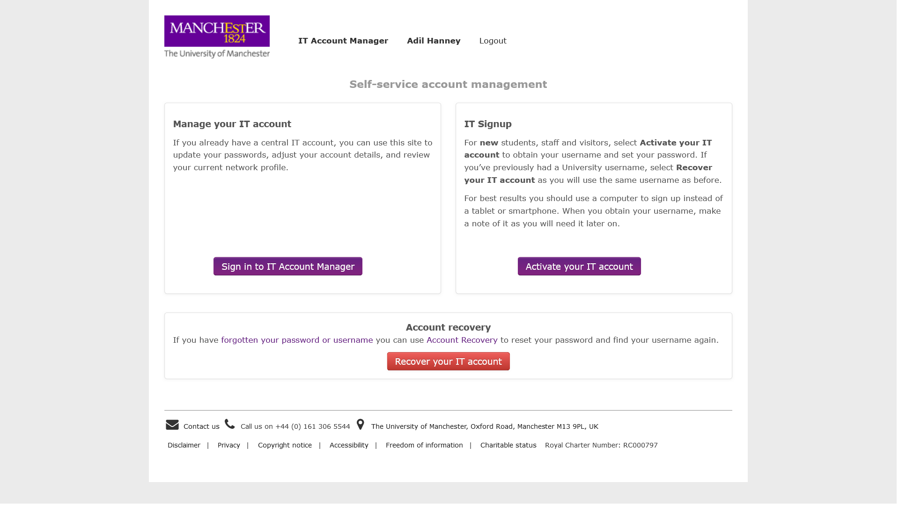 |  |
