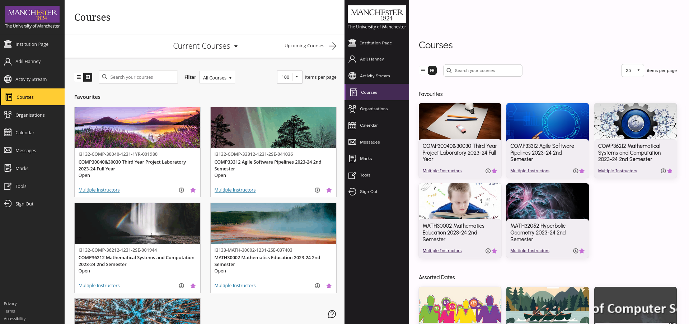
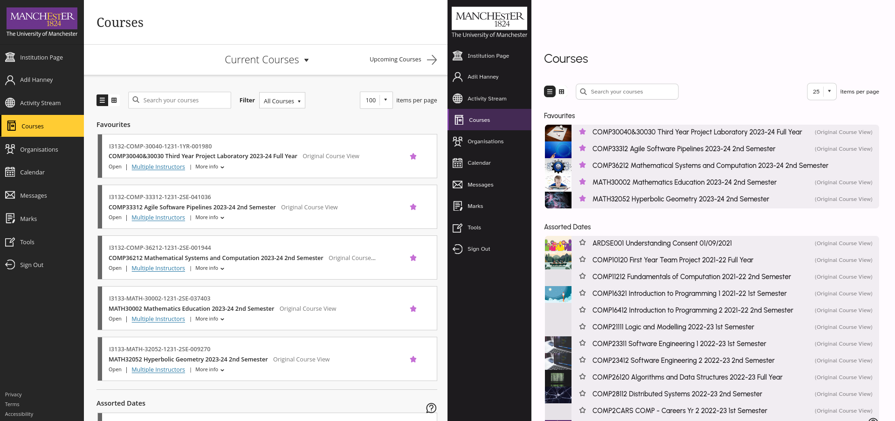

# UoM Blackboard theme

This project applies [Google's Material Design](https://m3.material.io/) to
the University of Manchester's websites.

This is more than just a theme; it also vastly improves the usability
and readability of the websites.

I was originally only restyling Blackboard, but I've since expanded it to
other UoM websites.

[](https://www.codefactor.io/repository/github/adil192/blackboardtheme)

## Install

Note: If you previously installed this theme via the Stylus and Tampermonkey extensions, you should uninstall them first.

Want to build the extension yourself? See the [Building](#building) section.

### Install on Firefox

1. Go to the [Releases](https://github.com/adil192/BlackboardTheme/releases) page,
scroll down to where it says "Assets" and click on the `UoM_Enhancements.xpi` file.

2. You will see a prompt asking you to add the extension. Click Continue and then Add.

### Install on Chrome (and other Chromium-based browsers, like Edge and Brave)

Go to the
[chrome web store page](https://chromewebstore.google.com/detail/uom-enhancements/igcbpelbigppckbhkmjfmjhgepoblfkn)
and click "Add to Chrome".

### Update

Both the Firefox and Chrome extensions will automatically update in the future.

## Why use this theme?

- Rethemes the Blackboard website
    - Better icons and logos
    - Locate your modules easily with the new **grid view**
    - When you're in the second semester, first semester modules will be dulled so you can focus on your new modules. *(requires script)*
    - Assessment/quiz pages have **more separation between questions to avoid overwhelming you**
- Rethemes the login and duo pages
    - Removes the useless FAQs no-one reads and adds a nice picture of Uni Place
- Rethemes the My Manchester portal including the attendance page
    - (My Manchester is currently offline anyway)
- Rethemes Blackboard videos
   - Captions are more readable with better fonts and a smaller width
   - More readable progress bar
   - **Standard keyboard shortcuts are added** *(requires script)*
      - Left and right arrow keys to skip 10 seconds
      - Up and down arrow keys to increase/decrease volume
      - Spacebar to play/pause
      - F key to toggle fullscreen
      - C key to toggle captions
    - Whether you have captions enabled is remembered between videos
    - Double click to toggle fullscreen
- Styling and colouring inspired by [Google's Material Design](https://m3.material.io/)
- Uses better, **more readable fonts** everywhere

Features marked with *requires script* require you to install the optional scripts (see the [Install](https://github.com/adil192/BlackboardTheme#install) instructions above).

## Screenshots

<details open>
<summary>Blackboard (Grid view)</summary>


</details>
<details open>
<summary>Blackboard (List view)</summary>


</details>
<details open>
<summary>Course page</summary>


</details>
<details open>
<summary>Assessments</summary>


</details>
<details open>
<summary>Login</summary>


</details>
<details open>
<summary>Duo 2FA</summary>


</details>
<details open>
<summary>Video player</summary>


</details>
<details open>
<summary>IT Account Manager</summary>


</details>

## Development notes

#### Building

1. Install the latest version of Dart via https://dart.dev/get-dart. If you have Flutter installed, you already have Dart. 

2. Install this project's dependencies (including the Dart Sass compiler) by running `pub get` in the project root.

3. Build the project by running `dart build.dart` in the project root.
   You can run `dart build.dart --watch` to automatically rebuild the project when you make changes.

4. The result is the `UoM_Enhancements.xpi` file. It can also be found unzipped in the `output` folder.

#### Folder structure

- `src/assets/` contains the images used in the theme, including the hardcoded module images.
- `src/scripts/` contains scripts that add functionality, such as video keyboard shortcuts and new-tab buttons.
- `src/styles/` contains the SCSS stylesheets for the theme.
- `src/manifest.jsonc` is the base manifest file for the extension, updated by `build.dart`.
- `src/style_injection.js` forces Chrome to prioritise the extension's styles over the website's styles.
- `build.dart` is a Dart script that compiles the SCSS and produces the final xpi file.
- `update_manifest.json` enables automatic updates for the extension on Firefox.

#### Adding a new subject to the [Module list images](https://greasyfork.org/en/scripts/479199-uom-blackboard-add-course-images) script

Unknown subjects are given an image from the [Pixabay API](https://pixabay.com/api/docs/).

If you want to add a custom image for your subject(s) to the
[Module list images](https://greasyfork.org/en/scripts/479199-uom-blackboard-add-course-images)
script, you can either
[submit an issue](https://github.com/adil192/BlackboardTheme/issues/new)
and I'll add it for you;
or you can do it yourself and submit a pull request:

1. Identify the module code. An example module code is `ABCD10000`.
2. Add an image to the `assets/subjects/ABCD10000/` folder where `ABCD10000` is the subject/module code (you'll need to make this folder). The image must be named `ABCD10000.jpg` or `ABCD10000.png` etc. Also add a `LICENSE.md` file with the image attribution/license.
3. Go to `scripts/add_course_images.js` and add a line to the `knownModuleImages` object. For example:
    ```js
    const knownModuleImages = {
        // ...
        "ABCD10000" : "../assets/subjects/ABCD10000/ABCD10000.jpg",
    };
    ```
