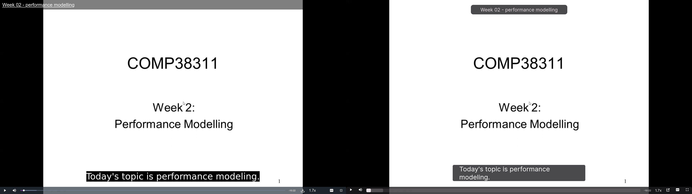

# UoM Blackboard theme

This project applies [Google's Material Design](https://m3.material.io/) to
the University of Manchester's websites.

This is more than just a theme; it also vastly improves the usability
and readability of the websites.

I was originally only restyling Blackboard, but I've since expanded it to
other UoM websites.

[](https://www.codefactor.io/repository/github/adil192/blackboardtheme)

## Install

### Install styling

- Install Stylus [for Firefox](https://addons.mozilla.org/en-GB/firefox/addon/styl-us/) or [for Chrome](https://chrome.google.com/webstore/detail/stylus/clngdbkpkpeebahjckkjfobafhncgmne) depending on your browser.
- Go to https://userstyles.world/style/4931/uom-blackboard-theme and click on the Install button.

### Install optional scripts

- Install Tampermonkey [for Firefox](https://addons.mozilla.org/en-GB/firefox/addon/tampermonkey/) or [for Chrome](https://chrome.google.com/webstore/detail/tampermonkey/dhdgffkkebhmkfjojejmpbldmpobfkfo)
- Go to each of these links and click on the Install button:
    - [Highlight current modules](https://greasyfork.org/en/scripts/478967-uom-blackboard-highlight-current-modules)
    - [Video keyboard shortcuts](https://greasyfork.org/en/scripts/479044-uom-blackboard-video-keyboard-shortcuts)
    - [Module list images](https://greasyfork.org/en/scripts/479199-uom-blackboard-add-course-images)
    - [Auto login](https://greasyfork.org/en/scripts/485669-uom-blackboard-auto-login)

### Atkinson Hyperlegible

- If you have low vision or would otherwise benefit from the [Atkinson Hyperlegible](https://fonts.google.com/specimen/Atkinson+Hyperlegible/about) font,
you can install the [Hyperlegible addon](https://userstyles.world/style/14032/uom-blackboard-theme-hyperlegible-addon) as well.

## Why use this theme?

- Rethemes the Blackboard website
    - Better icons and logos
    - Locate your modules easily with the new **grid view**
    - When you're in the second semester, first semester modules will be dulled so you can focus on your new modules. *(requires script)*
    - Assessment/quiz pages have **more separation between questions to avoid overwhelming you**
- Rethemes the login and duo pages
    - Removes the useless FAQs no-one reads and adds a nice picture of Uni Place
- Rethemes the My Manchester portal including the attendance page
    - (My Manchester is currently offline anyway)
- Rethemes Blackboard videos
   - Captions are more readable with better fonts and a smaller width
   - More readable progress bar
   - **Standard keyboard shortcuts are added** *(requires script)*
      - Left and right arrow keys to skip 10 seconds
      - Up and down arrow keys to increase/decrease volume
      - Spacebar to play/pause
      - F key to toggle fullscreen
      - C key to toggle captions
- Styling and colouring inspired by [Google's Material Design](https://m3.material.io/)
- Uses better, **more readable fonts** everywhere

Features marked with *requires script* require you to install the optional scripts (see the [Install](https://github.com/adil192/BlackboardTheme#install) instructions above).

## Screenshots

These screenshots are taken at 1.33x zoom:

<details open>
<summary>Blackboard</summary>


</details>
<details open>
<summary>Course page</summary>


</details>
<details open>
<summary>Assessments</summary>


</details>
<details open>
<summary>Login</summary>


</details>
<details open>
<summary>Duo 2FA</summary>


</details>
<details open>
<summary>Video player</summary>


</details>
<details open>
<summary>IT Account Manager</summary>


</details>

## Development notes

#### Folder structure

```
BlackboardTheme
├── assets (images and other assets used in the css)
│   └── subjects (for the "Module list images" script)
├── screenshots (used in this README)
├── scripts (for the optional scripts)
│   ├── add_course_images.js
│   ├── highlight_current_modules.js
│   └── video_keyboard_shortcuts.js
├── styles (each domain has its own scss file, except for...)
│   ├── _globals.scss (defines colours, fonts, etc.)
│   ├── _version.scss (the userstyle metadata, including the version number)
├── CHANGELOG.md
├── main.css (the compiled main.scss)
├── main.scss (imports all the other scss files)
├── package.json (defines dependencies for the lint workflow in `.github/workflows/lint.yml`)
└── README.md
```

#### Adding a new subject to the [Module list images](https://greasyfork.org/en/scripts/479199-uom-blackboard-add-course-images) script

Unknown subjects are given an image from the [Pixabay API](https://pixabay.com/api/docs/).

If you want to add a custom image for your subject(s) to the
[Module list images](https://greasyfork.org/en/scripts/479199-uom-blackboard-add-course-images)
script, you can either
[submit an issue](https://github.com/adil192/BlackboardTheme/issues/new)
and I'll add it for you;
or you can do it yourself and submit a pull request:

1. Identify the module code. An example module code is `ABCD10000`.
2. Add an image to the `assets/subjects/ABCD10000/` folder where `ABCD10000` is the subject/module code (you'll need to make this folder). The image must be named `ABCD10000.jpg` or `ABCD10000.png` etc. Also add a `LICENSE.md` file with the image attribution/license.
3. Go to `scripts/add_course_images.js` and add a line to the `knownModuleImages` object. For example:
    ```js
    const knownModuleImages = {
        // ...
        "ABCD10000" : "https://raw.githubusercontent.com/adil192/BlackboardTheme/main/assets/subjects/ABCD10000/ABCD10000.jpg",
    };
    ```
